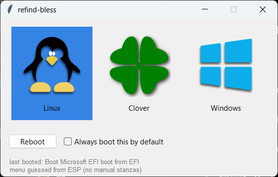

# refind-bless

A tiny Tkinter app that tells [rEFInd](https://www.rodsbooks.com/refind/)
which OS to boot next: one icon per OS and one Reboot button.



The name comes from macOS `bless(8)` (and `systemd-bless-boot`): to *bless*
a volume is to mark it as the one the firmware boots.

## Requirements

- A UEFI machine with rEFInd installed on the EFI System Partition (ESP).
- Python 3.7+ with Tkinter. On Windows, the python.org installer includes
  Tkinter. On Linux it's often a separate package:

  | Distro          | Package          |
  |-----------------|------------------|
  | Debian / Ubuntu | `python3-tk`     |
  | Fedora          | `python3-tkinter`|
  | Arch            | `tk`             |

- Linux: `pkexec` (polkit), and efivarfs mounted at
  `/sys/firmware/efi/efivars` (standard on systemd distros).

There are no pip dependencies. The app is the single file
`refind_bless.py`.

## How it works

1. It reads the menu from `EFI/refind/refind.conf` on the ESP, following
   `include`s. If the config has no manual `menuentry` stanzas (rEFInd
   auto-detects), the OS list is guessed from the ESP's loader
   directories. A Linux that rEFInd boots by kernel auto-detect, straight
   off its own partition, is inferred from the ext4/btrfs/... driver in
   `EFI/refind/drivers_*`.
2. It writes your choice to rEFInd's `PreviousBoot` EFI variable (firmware
   NVRAM, GUID `36d08fa7-cf0b-42f5-8f14-68df73ed3740`). rEFInd writes this
   same variable itself after you pick an entry.
3. It reboots. rEFInd preselects your choice.

The **"Always boot this by default"** checkbox controls the one line of
`refind.conf` the app may edit:

- **Unchecked** means "boot this next". The app makes sure the config says
  `default_selection +` (last-booted mode, rEFInd's default) and sets
  `PreviousBoot`. The choice is *sticky*, not one-shot: it stays the
  preselected entry until you boot something else.
- **Checked** means "pin it". The line becomes
  `default_selection "<entry>"`, so rEFInd highlights that OS every time,
  no matter what booted last.

The line is only rewritten when it has to change, the old value is kept
as a `# was:` comment, and a `refind.conf.bak` copy is saved. If your
config sets `use_nvram false`, rEFInd keeps `PreviousBoot` in
`EFI/refind/vars/` on the ESP instead, and the app writes it there, just
as rEFInd would.

## Linux

```sh
./refind_bless.py          # normal run
./refind_bless.py --demo   # UI preview: no privileges, no reboot
```

The ESP is usually readable by root only, so the app re-runs its reader
through `pkexec`. That's one auth prompt, and the result is cached in
`~/.cache/refind-bless.json`. Writing the NVRAM variable at reboot time is
a second `pkexec` prompt. The reboot itself is a plain `systemctl reboot`.

**Tip:** to avoid the startup prompt, make the ESP world-readable by adding
`umask=0022` to its options in `/etc/fstab`. Then only the NVRAM write
asks for authentication.

**Menu entry:** `refind-bless.desktop` needs the absolute path of your
checkout in `Exec=`. Fill it in and install a copy:

```sh
sed -i "s#^Exec=.*#Exec=python3 $PWD/refind_bless.py#" refind-bless.desktop
cp refind-bless.desktop ~/.local/share/applications/   # or ~/Desktop
```

## Windows

Double-click **`refind-bless.bat`**. It asks for admin rights through UAC,
which the app needs to mount the ESP (`mountvol /S`) and to write the
firmware variable (`SetFirmwareEnvironmentVariableW`). It then starts the
app without a console window. You can put a shortcut to the `.bat` on the
Desktop.

### Skipping the UAC prompt

A shortcut can't skip UAC. Ticking "Run as administrator" on it is what
*causes* the prompt. A scheduled task set to "Run with highest
privileges" can skip it: you approve UAC once, when you create the task,
and after that it starts elevated with no prompt. Run this from an
**elevated** PowerShell in the checkout folder:

```powershell
$action = New-ScheduledTaskAction -Execute (Get-Command pyw).Source `
            -Argument '-3 refind_bless.py' -WorkingDirectory $PWD
$principal = New-ScheduledTaskPrincipal -UserId "$env:USERDOMAIN\$env:USERNAME" `
               -LogonType Interactive -RunLevel Highest
$settings = New-ScheduledTaskSettingsSet -AllowStartIfOnBatteries `
              -DontStopIfGoingOnBatteries -ExecutionTimeLimit 0 -MultipleInstances Parallel
Register-ScheduledTask refind-bless -Action $action -Principal $principal -Settings $settings
```

Then point a Desktop shortcut at the task:

- **Target:** `C:\Windows\System32\conhost.exe --headless schtasks.exe /run /tn "refind-bless"`
- **Advanced → Run as administrator:** *unchecked*. Otherwise UAC asks to
  elevate `schtasks` itself.

Why each part is there:

- The task runs `pyw` (the windowless Python launcher) directly instead of
  the `.bat`, so no console opens. The `.bat`'s own elevation check isn't
  needed because the task is already elevated.
- `conhost --headless` hides the console window that `schtasks` would
  open. Starting it minimized isn't enough, since it still shows up on the
  taskbar.
- Windows won't let a program started by Task Scheduler bring its window
  to the front, so the app would open *behind* the window you're using.
  To get around this, `to_front()` in `run_gui` raises the window, sends a
  synthetic Alt key tap (Windows lets a process take focus right after
  keyboard input), and then calls `SetForegroundWindow`. The window also
  gets keyboard focus, so Enter, Esc and the arrow keys work right away.

To undo all this, run `Unregister-ScheduledTask refind-bless` from an
elevated PowerShell and point the shortcut back at the `.bat`. If you move
the checkout, re-register the task, because its working directory is an
absolute path.

## Limitations

- **Only one ESP is checked.** On Windows, `mountvol /S` mounts the ESP of
  the disk Windows booted from. On Linux the app looks in `/boot/efi`,
  `/efi` and `/boot`. If rEFInd lives on a different disk's ESP, the app
  reports that no rEFInd installation was found.
- **Menu titles have to match.** rEFInd matches `PreviousBoot` and
  `default_selection` as substrings of the menu entry *titles*. Guessed
  titles, such as those from auto-detected entries, are best-effort.
- **Only Linux, Windows and macOS entries are shown.** Tools like the
  shell or memtest are left out.

## Testing without touching the system

`--esp PATH` points the helper at a fake ESP tree. In this mode the
firmware is never touched: `bless` writes `EFI/refind/vars/PreviousBoot`
inside the fake tree instead of NVRAM.

```sh
./refind_bless.py --helper snapshot --esp /path/to/fake-esp
./refind_bless.py --helper bless "Windows 11" --esp /path/to/fake-esp
```

## Files

- `refind_bless.py`: the whole app (GUI and privileged helper mode)
- `refind-bless.desktop`: Linux menu entry template
- `refind-bless.bat`: Windows launcher (asks for admin rights itself)

## Credits

Designed by [lucianoiam](https://github.com/lucianoiam), written by
[Claude](https://claude.com/claude-code) (Anthropic's AI coding assistant).

## License

MIT. See [LICENSE](LICENSE).
